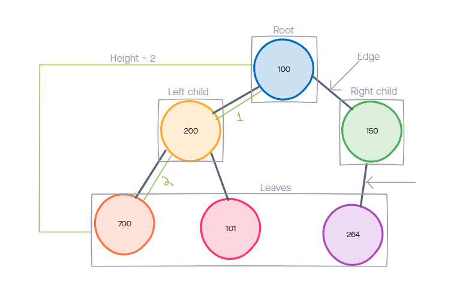
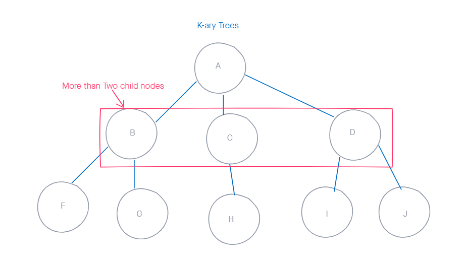

# Code 401 - Advanced Software Development

## 401 Reading Notes: Class 15

### Readings: Implementation: Trees

#### Terms

- **Node** - A Tree node is a component which may contain it’s own values, and references to other nodes

- **Root** - The root is the node at the beginning of the tree

- **K** - A number that specifies the maximum number of children any node may have in a k-ary tree. In a binary tree, `k = 2`.

- **Left** - A reference to one child node, in a binary tree

- **Right** - A reference to the other child node, in a binary tree

- **Edge** - The edge in a tree is the link between a parent and child node

- **Leaf** - A leaf is a node that does not have any children

- **Height** - The height of a tree is the number of edges from the root to the furthest leaf

#### Traversals

Traversing a tree allows us to search for a node, print out the contents of a tree, and there are two categories of traversals when it comes to trees:

- Depth First: prioritize going through the depth (height) of the tree first using a call stack via recursion
  - Pre-order: `root >> left >> right`
  - In-order: `left >> root >> right`
  - Post-order: `left >> right >> root`

- Breadth First: first traversal iterates through the tree by going through each level of the tree node-by-node. It uses uses a queue to traverse the width/breadth of the tree
  - uses methods : `enqueue` and `dequeue`

#### Binary Tree Vs K-ary Trees

Binary Trees restrict the number of children to two (left and right children).

K-ary Tree is able to have more than 2 child nodes.

- Traversing a K-ary tree requires a similar approach to the breadth first traversal. We are still pushing nodes into a queue, but we are now moving down a list of children of length k, instead of checking for the presence of a left and a right child.

#### Adding a node

There are no rules where a nodes can go in a binary tree. You can put the node any place on the tree.

  - Best strategy is fill all the child spots from top down.
  - use the breadth first traversal
  - find the first node that does not have all it’s children filled
  - insert the new node as a child and fill the child slots from left to right.
  - If you want to place a node in a specific location
    - reference both the new node to create, and the parent node upon which the child is attached to.

#### Big O

Inserting a new node is `O(n)` and Searching for a node is `O(n)`, Because of the lack of organizational structure in a Binary Tree, worst case for most operations will involve traversing the entire tree.

Big O space complexity for a node insertion using breadth first insertion will be `O(w)`, where `w` is the largest width of the tree

A perfect binary tree is one where every non-leaf node has exactly two children. The maximum width for a perfect binary tree, is `2^(h-1)`, where `h` is the height of the tree. Height can be calculated as `log n`, where `n` is the number of nodes.

#### Binary Search Trees

A Binary Search Tree (BST) is a type of tree that does have some structure attached to it. The nodes are organized where all values that are smaller than the root are placed to the left, and all values that are larger than the root are placed to the right.

Searching a BST can be done quickly, because all you do is compare the node you are searching for against the root of the tree or sub-tree. If the value is smaller, you only traverse the left side. If the value is larger, you only traverse the right side.

The best way to approach a BST search is with a while loop.
