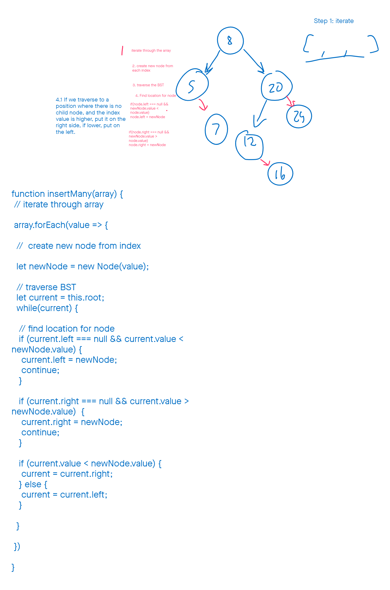

# Code 401 - Advanced Software Development

## 401 Reading Notes: Class 17 : AWS: S3 and Lambda

### Review:

- EC2:

  - allows someone to rent out virtual computing hardware

  - As the developer we can tell the computer what to do

- Elastic Beanstalk:

  - Virtual software, for creating and scaling `web applications`

  - It has configuration settings for operating system, runtime environments, hypervisor software, etc.

    - We tell our elastic beanstalk app, where the source should come from:
      - Zip file uploaded via a GUI
        - take all of the source code / excluding all `build artifacts`, and zip it up
          - nodes_modules: exclude
          - package-lock.json:exclude
        - Make sure to include the `package.json`
          - let elastic beanstalk / ec2 know what dependencies
          - execution scripts `npm starts`, `npm test`
      - cli that does this via a command

  - Environments:
    - This architecture > language
    - environment variables

  - Provisions our EC2 instance with the things that are required for the hardware.

### S3

S3 (Simple Storage Service): analogous to github, marketed towards images,videos, large files
  - Cloud based directory system
  - This is not a database
    - what do databases store
      - Stores data? Difference between `file` and `data`
        - atomic /scalar
  - file storage / repostitories store whole files
    - larger amounts of more varied information
  - may have public or private access

Want to make public:

attach the following policy to your bucket:
```json
{
  "Version": "2008-10-17",
  "Statement": [{"Sid": "AllowPublicRead",
    "Effect": "Allow",
    "Principal": {
      "AWS": "*"
    },
  "Action": "s3:GetObject",
  "Resource": "arn:aws:s3:::YOUR-BUCKET-NAME/*"
}]}
```


### Lambda

Highly targeting `micro` server functions
  - a single function that run whenever we as the developers want
  - should have one specific job
  - programmatically accessed through AWS

If you want to get Lambda to make changes to another service
  - 1. Click Configuration for your lamba function
  - 2. Select the role associated with your lambda
      1. Role details should appear: click `attach policy`
      2. Search for the AWS product you would like to permit
      3. Click checkbox next to appropriate policy
      4. click `attack policy` at the bottom.

Demo: Lambda

```javascrpit
const AWS = require('aws-sdk');

const s3 = new AWS.S3();

exports.handler = async (event) => {
    
    console.log(event.Records[0].s3.bucket.name);
    console.log(event.Records[0].s3);
    
    // name for the S3 bucket
    let bucketName = event.Records[0].s3.bucket.name;
    // name of the file associated with the event (uploaded image name)
    let srcKey = event.Records[0].s3.object.key;
    
    const newImage = await s3.putObject({
        Bucket: bucketName,
        Key: `test.json`,
        Body: '{"test": "test"}'
    }).promise();
    
    console.log(newImage);
    
    const response = {
        statusCode: 200,
        body: JSON.stringify('Hello from Lambda!'),
    };
    return response;
};
```

### Warm Up:

- Create a function that takes an Array of values, and can appropriately insert them into a Binary Search Tree. Feel free to use any methods you have previously created on a Binary Search Tree.

```javascript

class Node  {
  constructor(value) {
    this.value = value;
    this.left = null;
    this.right = null;
  }
}

class BinarySearchTree {
  constructor() {
    this.root = null;
  }

  insertMany(values) {
    // how can we insert all these values into our tree
  }
}

```
- What steps should be taken to be able to insert values from an array?
  - Describe what a computer needs to do at each step without using a programming language.

- 

