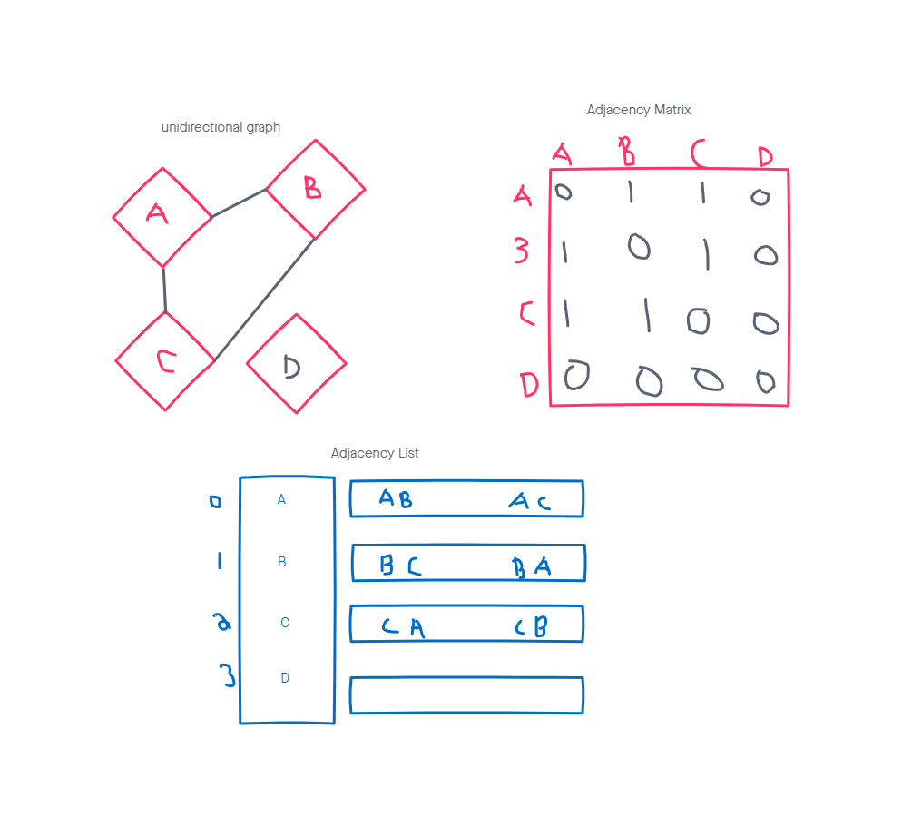
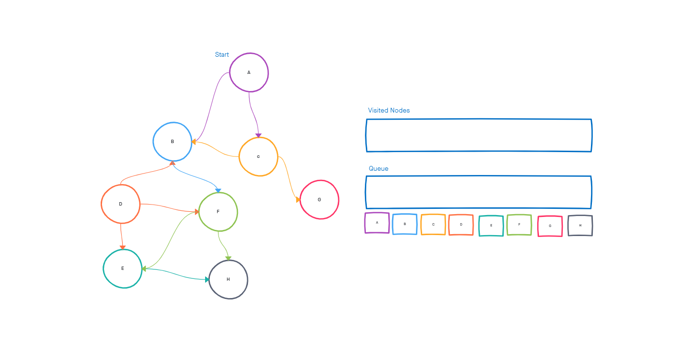

# Class 35: DSA Graphs

## Overview

* A collection of Nodes / Vertices.
* Nodes are typically connected, Potentially we have nodes with no connection.

* A tree is a Directional, Acyclical, Graph.

## Terminology

* Vertex: A new name for our node. Contains a Value.
* Edge: A connection between Vertices / Nodes.
* Neighbor: A Vertex that shares an edge with another vertex.
* Degree: The number of Edges to other Vertices a Node has.
* Weight: A number that represents the strength of a connection.

## Directionality

Is a a property of an Edge.  An edge is directed when it has a starting and ending Node / Vertex.  If no starting / ending specified it is known as undirected.

## Cycles

Whether your Vertices can point back to itself via traversal.  An Acyclic graph has no cycles.

## Complete vs Connected vs Disconnected

Complete - Every vertex is connected is connected to every other vertex.
Connected - every vertex has at least one connection / edge.
Disconnected - there is potially a node that does not have an edge.

## Representations

* Adjacency Matrix
  * A n x n list of node connections. n being the number of nodes in the graph.
* Adjacency List
  * An array of objects / linked lists
  * Each Vertex  / node is an index of the array.

## Traversals

Looking at all the values from a given starting Vertex.

* Breadth First Traversal
  * Look at neighboring Vertices before moving to further Vertices.

## Implementation

* Add New Vertices
* Add New Edges
* Look at Neighbors

## UML

